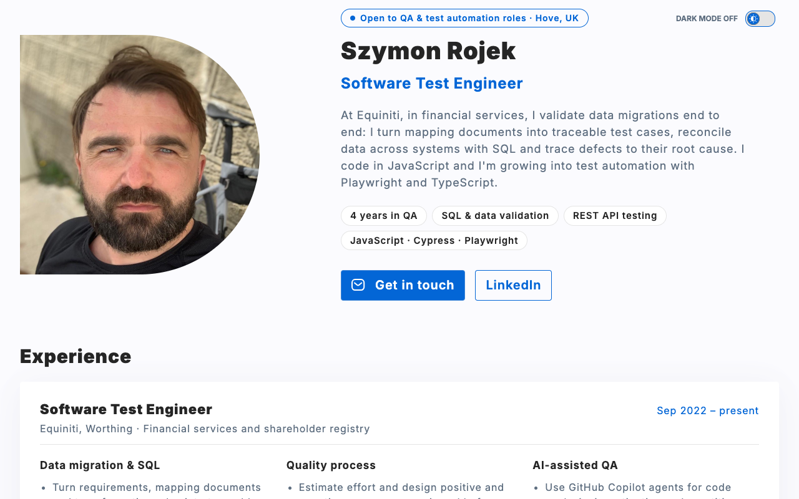
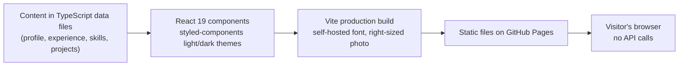
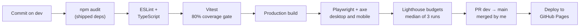
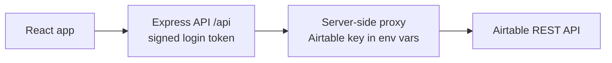
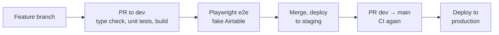

# Szymon Rojek: Software Test Engineer

**Live site: [szymonrojek.github.io/homepage](https://szymonrojek.github.io/homepage/)** · [LinkedIn](https://www.linkedin.com/in/szymonrojek/)

[](https://github.com/SzymonRojek/homepage/actions/workflows/ci.yml)

<picture>
  <source media="(prefers-color-scheme: dark)" srcset="docs/screenshot-dark.png" />
  
</picture>

## Why this site exists (30-second summary)

- **Who:** Software Test Engineer with four years' experience testing financial and shareholder data migrations at Equiniti. Data migration and ETL testing, SQL reconciliation, REST API testing, growing into test automation with Playwright and TypeScript.
- **Looking for:** QA Engineer and Data/ETL Test Analyst roles. Based in Hove, UK, with full right to work in the UK, and open to relocation.
- **What the site proves:** a CV can say "Playwright" and "CI/CD", but this repository shows it. The site is a small production system that ships only when unit, end-to-end, accessibility, performance and security checks all pass, and every decision behind it is written up below.

| At a glance           |                                                                                      |
| --------------------- | ------------------------------------------------------------------------------------ |
| Automated tests       | 50 unit and component tests, 52 end-to-end runs (desktop and mobile)                 |
| Coverage              | about 86%, with an 80% gate that fails CI                                            |
| Lighthouse (enforced) | accessibility, best practices and SEO 100, performance budget enforced on every push |
| Accessibility         | 0 serious or critical axe violations, in the light and the dark theme                |
| Runtime API calls     | 0, so nothing can fail for a visitor                                                 |
| Deploys               | only from `main`, only after every check passes, only through a PR I merge           |

## Case study: this portfolio, tested like a production app

### Problem

A CV can list tools, but a recruiter can't verify them. I wanted the portfolio itself to be the evidence: readable by HR in 30 seconds, and able to stand up to a hiring manager's review of the code.

The earlier version loaded my projects from the GitHub API in the visitor's browser. That API allows 60 unauthenticated requests per hour per IP address, so a recruiter on a shared office network could see an error box in the middle of a tester's portfolio.

### Constraints

- Free static hosting on GitHub Pages under `/homepage/`, with no server.
- One maintainer with limited time, so automation has to catch regressions.
- Privacy: no phone number anywhere on the site.
- WCAG AA colour contrast in both the light and the dark theme.
- An older Mac (macOS 12) where Playwright can't install its own browser, so local runs use the installed Chrome and CI uses Playwright's Chromium.

### Architecture

What a visitor's browser loads. All content is static, so there is nothing to time out or rate-limit:



How every change reaches production:



### Key decisions and trade-offs

| Decision                                                 | Why                                                                                          | Trade-off                                                                                          |
| -------------------------------------------------------- | -------------------------------------------------------------------------------------------- | -------------------------------------------------------------------------------------------------- |
| Static project data instead of the GitHub API            | Rate limits on shared networks could show recruiters an error                                | Descriptions are updated by hand. An e2e fixture fails if the page ever calls the GitHub API again |
| Test pyramid: Vitest, then Playwright, then axe          | Fast feedback on logic, real confidence in what visitors see                                 | E2E takes about a minute, so it covers only user-visible behaviour                                 |
| 80% coverage gate that leaves out styles                 | Coverage should measure logic, not CSS                                                       | Styles are checked by the e2e and axe tests instead                                                |
| Paint the theme before JavaScript loads                  | Reloading in dark mode briefly flashed a light page                                          | The background colours live in two places. A unit test keeps them in sync                          |
| Self-hosted font and a right-sized photo                 | Google Fonts blocked rendering, and the photo was three times larger than displayed          | Font updates come through npm instead of Google                                                    |
| Lighthouse judged on the median of three runs            | The default (best run) could let a budget pass by luck                                       | Slower CI, and a stricter budget on a page that still renders with JavaScript                      |
| Protected `main`, dev-first workflow, PRs I merge myself | Every push to `main` deploys. The rule also stops an AI coding assistant shipping on its own | Even a one-line fix needs a PR and a green pipeline                                                |

### Testing, performance, accessibility and security

**Testing.** Vitest and Testing Library cover logic and components: theme state and persistence, the OS theme listener, the first-paint theme colours, project tiles, case studies and contact buttons. Playwright runs against the production build in desktop and mobile Chrome. Tests are grouped by page section, use named steps for longer scenarios, and are tagged `@desktop` or `@mobile` when they apply to one viewport only. Role-based locators also check that every control has an accessible name. Every test fails if the page calls the GitHub API. Stryker mutation testing (`npm run test:mutation`, or the manual GitHub workflow) checks that the unit tests actually catch bugs. Style-only files are left out, as they are from coverage. After targeted tests, every mutant in the files that had gaps was caught (102 killed, 8 timed out).

**Performance.** Lighthouse runs three times on every push. CI fails if the median performance score drops below 0.85 or layout shift goes above 0.1, and warns when the largest paint is slower than 2.5 s. Self-hosting the font and resizing the photo raised the mobile performance score from 0.84 to about 0.9 on my machine and brought the first paint forward from 3.0 s to about 2.2 s. The photo went from 117 KB to 54 KB, and the JavaScript is about 104 KB gzipped. The page still renders with JavaScript, so prerendering the HTML is the next step.

**Accessibility.** axe scans the page in the light and the dark theme with every case study expanded, and any serious or critical violation fails the build. Lighthouse accessibility must stay at 95 or above (it is 100 today). The page uses semantic headings and landmarks, labelled lists, a theme switch with `aria-pressed`, and decorative icons hidden from screen readers.

**Security.** There are no secrets and no runtime API calls. `npm audit` fails CI on high-severity advisories in the dependencies shipped to visitors, and Dependabot proposes npm and GitHub Actions updates every week, targeted at `dev`. External links use `rel="noreferrer"`, and no phone number is published. Development-only tools such as Lighthouse CI still carry some advisories. They never reach the browser, which is why the audit gate covers only shipped dependencies.

### Outcomes

- Projects render instantly and can't fail for a visitor: the section no longer depends on GitHub's API.
- No light flash on reload in dark mode, proven by a test that records the background colour on every frame.
- Lighthouse accessibility, best practices and SEO all score 100; performance is held by a CI budget.
- Every deploy has passed the full pipeline, because `main` accepts nothing else.

### Lessons learned

- A bug I couldn't reproduce, a light flash on reload, became solvable once I wrote a failing test that recorded the background colour on every frame.
- A fix can look broken because of browser caching. I now check what the server actually serves before changing the code again.
- When removing well-tested code lowered coverage, I added tests for real branches instead of lowering the threshold.
- End-to-end tests hard-code the text a visitor sees instead of importing it from the data files, so a content mistake can't pass by testing itself.
- Lighthouse CI judges the best of three runs by default. I switched to the median so the budget can't pass by luck.
- Mutation testing with Stryker showed that 80%+ coverage hid real gaps: a saved dark theme, the state on page load, the commas between interests and the content of each case-study section were never checked. The tool needed checking too: a runner bug first reported 13.6% because no tests ran for most mutants, and slow runs on a busy machine can turn into timeouts that look like caught bugs.
- A test that rendered the whole page pushed coverage to 98% while it only checked the theme. I mocked the page in that test; coverage fell to an honest 86%.

## Case study: email campaign app, secured and tested

**[Code](https://github.com/SzymonRojek/email-campaign-react-airtable)** · **[Live demo](https://email-campaign-react-airtable.onrender.com/)** (password `admin`; the free server can take up to a minute to wake up)

A full-stack React, Express and TypeScript app that manages subscribers and email campaigns in Airtable. I reviewed it like a tester, fixed what I found, and made it safe to change.

| At a glance         |                                                                             |
| ------------------- | --------------------------------------------------------------------------- |
| API keys in browser | 0: the Express server is the only thing that talks to Airtable              |
| Automated tests     | 70+ server and client unit tests, 27 Playwright end-to-end tests            |
| Test data           | end-to-end tests run against a fake Airtable, so they never touch real data |
| Bugs fixed          | 11 found and fixed in one review                                            |
| Delivery            | pull request checks, then staging, then production, all automatic           |

### Problem

The Airtable key already stayed on the server, behind an Express proxy. But the login only ran in the browser, so anyone who called the API directly could read, change or delete every subscriber. The API had been tested by hand in Postman, there were no automated tests or CI, and the free Heroku hosting had ended.

### Architecture





### Key decisions and trade-offs

| Decision                                      | Why                                                             | Trade-off                                                                        |
| --------------------------------------------- | --------------------------------------------------------------- | -------------------------------------------------------------------------------- |
| Server-side login with HMAC-signed tokens     | A browser-only login didn't protect the API at all              | One shared demo password; the lockout lives in memory and resets on restart      |
| Lock an IP out after 5 wrong passwords        | Basic protection against password guessing                      | Visitors behind one shared IP can lock each other out                            |
| End-to-end tests against a fake Airtable      | Tests must never touch real data, and CI needs no secrets       | The fake can drift from the real API, so it copies Airtable's records and errors |
| Real email sending turned off in the demo     | With a public password, anyone could send email from my account | The demo marks a campaign as sent and says clearly that no email went out        |
| Staging before production, with a hotfix path | Changes are checked on a live copy before users see them        | Two environments to keep in sync; a hotfix must be merged back into `dev`        |

### What the review found

- The Airtable token leaked in error responses.
- Unchecking every subscriber sent the email to **all** of them: an empty selection was treated as "no filter".
- Lists silently stopped at 100 records, because Airtable pages its results.
- Polish names such as Łukasz sorted after "z" until sorting used a Polish locale.
- Deleting a record didn't wait for Airtable, so a failure could crash the server.

### Lessons learned

- Anything a server returns on failure needs the same care as a success response.
- Edge cases like an empty list deserve their own test.
- Testing with more data than one page is cheap and catches paging bugs.
- Test data should look like real users' data, including their alphabet.
- A fake API makes end-to-end tests fast and safe, but only if it behaves like the real one, including its errors.

---

## For developers

### Tech stack

| Area      | Tools                                                                 |
| --------- | --------------------------------------------------------------------- |
| Front-end | React 19, TypeScript (strict), Vite                                   |
| State     | Redux Toolkit (theme)                                                 |
| Styling   | styled-components with light and dark themes, self-hosted Inter       |
| Testing   | Vitest, Testing Library, Playwright, axe-core, Lighthouse CI, Stryker |
| Quality   | ESLint, Prettier, GitHub Actions, npm audit, Dependabot               |
| Hosting   | GitHub Pages, deployed automatically from `main`                      |

### Getting started

Requires Node 20.19+ or 22.12+.

```bash
npm install
npm run dev          # http://localhost:3000/homepage/
```

| Script                    | What it does                                                    |
| ------------------------- | --------------------------------------------------------------- |
| `npm run dev`             | Start the dev server                                            |
| `npm run build`           | Build the site into `dist/`                                     |
| `npm run preview`         | Serve the production build locally                              |
| `npm test`                | Unit and component tests in watch mode                          |
| `npm run test:coverage`   | Single test run with a coverage report and thresholds           |
| `npm run test:e2e`        | Playwright end-to-end tests (builds and serves the site)        |
| `npm run test:mutation`   | Stryker mutation testing of the unit tests (slow, run manually) |
| `npm run test:lighthouse` | Lighthouse budgets against `dist/` (run `build` first)          |
| `npm run typecheck`       | TypeScript check                                                |
| `npm run lint`            | ESLint                                                          |

### CI and deployment

Work happens on the `dev` branch. Every push to `dev` or `main` and every pull request runs, in [GitHub Actions](.github/workflows/ci.yml): the dependency audit, lint, type check, unit tests with the coverage gate, the build, the end-to-end and accessibility tests and the Lighthouse budgets. Mutation testing runs separately, by hand: the [Mutation testing workflow](.github/workflows/mutation.yml) ("Run workflow" in the Actions tab) runs Stryker on GitHub's servers, writes the score per file to the run summary and uploads the HTML report. `main` is production and is protected: changes reach it only through a pull request from `dev` with passing checks, and only `main` deploys to GitHub Pages.

### Editing content

All text lives in data files, not in components:

| File                                              | Content                                                                      |
| ------------------------------------------------- | ---------------------------------------------------------------------------- |
| `src/features/Homepage/profile.ts`                | Name, title, target roles, location, bio, key skills, contact text, LinkedIn |
| `src/features/Homepage/skillsData.ts`             | Core skills (eight chips) and tools                                          |
| `src/features/Homepage/experienceData.ts`         | Experience, education, languages and interests                               |
| `src/features/Homepage/Portfolio/projectsData.ts` | Projects and their optional `caseStudy` write-ups                            |
| `src/features/Homepage/qualityData.ts`            | The "How this site is tested" section                                        |

To add a case study, fill in the `caseStudy` field of a project in `projectsData.ts`. The project moves from a tile to a full case-study card on the site. Keep this README's case study in step with the homepage one.
